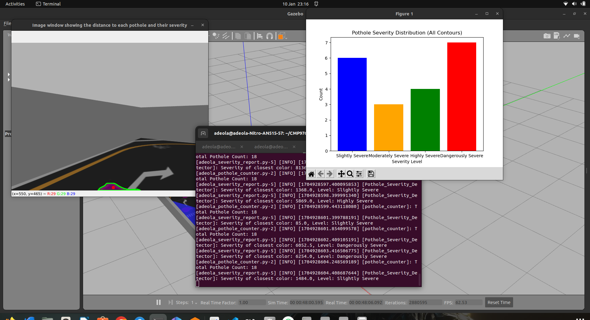
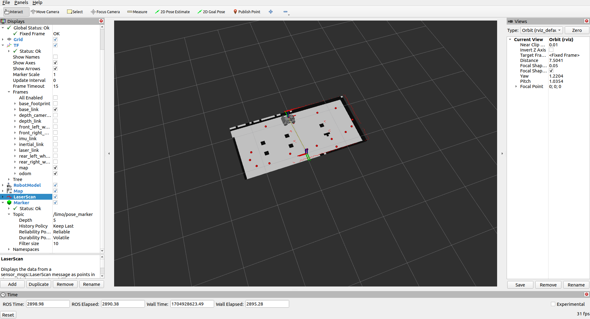
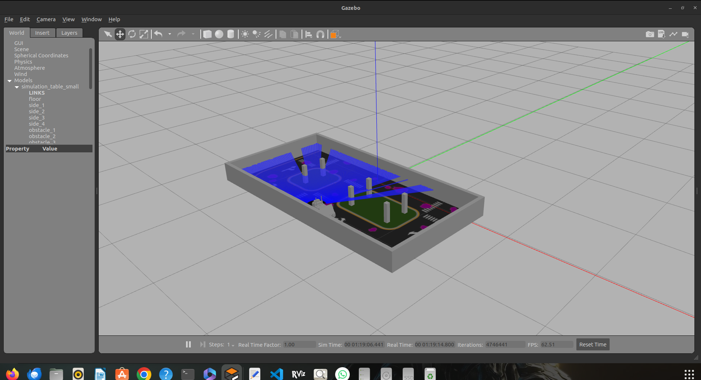

# CMP9767-Assessment-LIMO-Robot-Pothole-Detection

A software system for a LIMO mobile robot deployed to solve a road inspection task. The goal of the task is to automatically appraise the quality of the road surface and report that information to the human user.

## Overview

Welcome to the CMP9767 Assessment repository! This project focuses on developing a comprehensive software system for a LIMO mobile robot designed for road inspection. The primary objective is to autonomously evaluate road surface quality, particularly in detecting and reporting potholes.

## Getting Started

To get started with the project, follow the steps outlined below:

1. **Clone the "limo_ros2" Repository:**
    ```bash
    git clone https://github.com/LCAS/limo_ros2
    ```

2. **Navigate to the "limo_ros2" Directory:**
    ```bash
    cd limo_ros2
    ```

3. **Build the "limo_ros2" Workspace:**
    ```bash
    colcon build
    source install/setup.bash
    ```

4. **Return to the Parent Directory:**
    ```bash
    cd ..
    ```

5. **Clone the "CMP9767-Assessment-LIMO-Robot-Pothole-Detection" Repository:**
    ```bash
    git clone https://github.com/Patenro/CMP9767-Assessment-LIMO-Robot-Pothole-Detection-.git
    ```

6. **Navigate to the Project Directory:**
    ```bash
    cd CMP9767-Assessment-LIMO-Robot-Pothole-Detection
    ```

7. **Build and Source the Workspace:**
    ```bash
    colcon build
    source install/setup.bash
    ```

8. **Launch the Simulation Environment:**
    ```bash
    # Command to launch Gazebo world
    ros2 launch limo_gazebosim limo_gazebo_diff.launch.py world:=/path/to/your/world/file.world
    
    # Command to launch navigation system
    ros2 launch limo_navigation limo_navigation.launch.py use_sim_time:=true map:=/path/to/your/map.yaml
    
    # Command to launch pothole detector
    ros2 launch limo_assessment pothole_detector.launch.py
    ```

## Project Components

### Python Executables

The project includes several Python executables to achieve different functionalities:

- `adeola_autonomous_navigation.py`: Implements a reactive navigation strategy based on laser sensor data.
- `adeola_pothole_counter.py`: Utilizes color segmentation and contour drawing to count and locate potholes.
- `adeola_posedetector1.py`: Uses TF transforms to get pothole coordinates relative to the fixed map.
- `adeola_marker.py`: Subscribes to pothole coordinates and publishes markers for visualization in RViz.
- `adeola_severity_report.py`: Calculates pothole severity based on area and generates a bar chart.

Ensure to update the file paths in the launch file to match your system.

### Navigation Strategy

The autonomous navigation code reacts to obstacles, turning away from areas with more obstacles. The simplicity of the navigation code allows for effective movement based on laser sensor data.

### Pothole Detection

The pothole counter uses color segmentation and contour drawing to identify and count potholes. Pose detectors determine the location of potholes relative to the fixed map or robot odometry.

### Severity Report

The severity report code calculates pothole severity based on area and assigns a color. The results are saved in a text file, and a bar chart is generated to visualize the severity levels.

## Images


*Gazebo World*


*Marked Potholes*


*Severity Report with Bar Graph*

